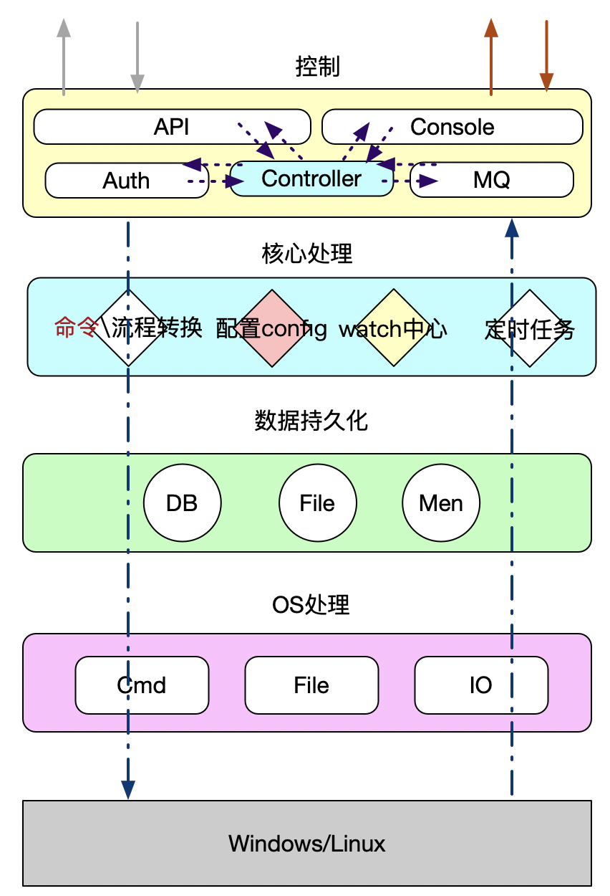
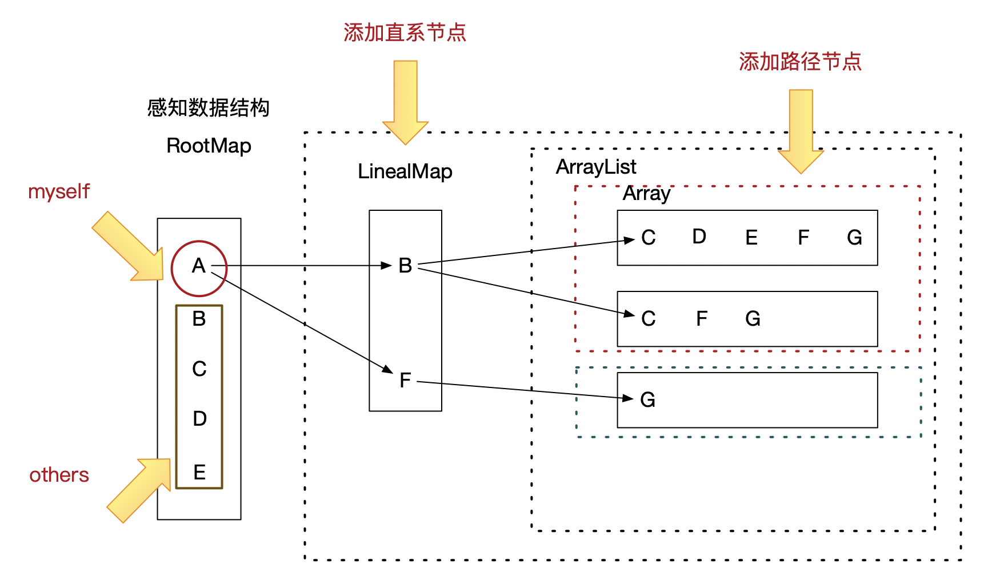

# 节点代理

## keywords

keywords en： System control、agent

keywords ch：节点控制、节点监控、服务器监控、系统控制  


## 描述

做一个节点控制的工具，可供远程操控机器，执行命令、传输文件


## 规定

### 文件命令规定

|        作用        | 缩写 | 备注 |
| :----------------: | :--: | :--: |
| 对象、pojo、struct |  ob  |      |
|        接口        |  in  |      |
|  业务、实现、处理  |  bz  |      |
|        工具        |  cm  |      |


## 总体设计




## 功能设计

### watch功能

其中任务池使用 https://github.com/wazsmwazsm/mortar/


#### 使用流程

watch功能需要首先创建一个watch工厂作为watch处理核心，创建工厂时可指定并行处理的最大线程数，随后将自定义的被观察者向工厂注册。被观察者需要自己实现`IObserver` 的`WatchHandler` 方法,请看以下示例:

##### **setup 1 自定义被观察者**

```go
type TestObserver struct {
	Name string
}
func (this *TestObserver) WatchHandler(v interface{}) error {
	fmt.Println("I am ",this.Name,"  do val:",v)
	return nil
}
```

##### **setup 2 创建工厂**

```go
//创建watch工厂
factory := MyWatch.MyWatchFactory{}
//初始化工厂并行任务数
factory.Init(10)
```

##### **setup 3 创建被观察者**

```go
var w1 MyWatch.IObserver
var w2 MyWatch.IObserver

w1 = &TestObserver{"T1"}
w2 = &TestObserver{"T2"}
```

##### **setup 4 注册被观察者**

```go
factory.AddObserver("topic_desc",w1);
factory.AddObserver("topic_desc",w2);
```

##### **setup5 变更通知**

```go
factory.UpdateValue("topic_desc","hello topic_desc")
```

##### 整体代码Demo

```go
package main

func main() {
	c := make(chan bool,1)

	factory := MyWatch.MyWatchFactory{}
	factory.Init(10)

	var w1 MyWatch.IObserver
	var w2 MyWatch.IObserver

	w1 = &TestObserver{"T1"}
	w2 = &TestObserver{"T2"}

	factory.AddObserver("topic_desc",w1);
	factory.AddObserver("topic_desc",w2);

	factory.UpdateValue("topic_desc","hello topic_desc")
	<-c
}

type TestObserver struct {
	Name string
}
func (this *TestObserver) WatchHandler(v interface{}) error {
	fmt.Println("I am ",this.Name,"  do val:",v)
	return nil
}
```

**运行结果**

```shell
I am  T1   do val: hello topic_desc
I am  T2   do val: hello topic_desc
```


### 感知设计

##### 感知流程


##### 感知数据结构



## 进展

