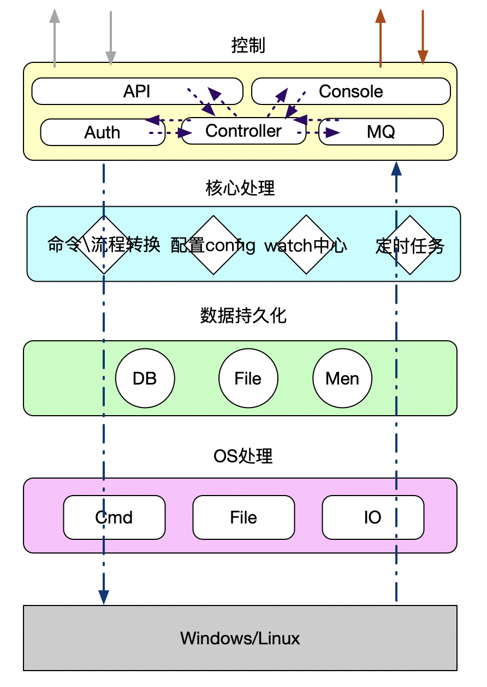
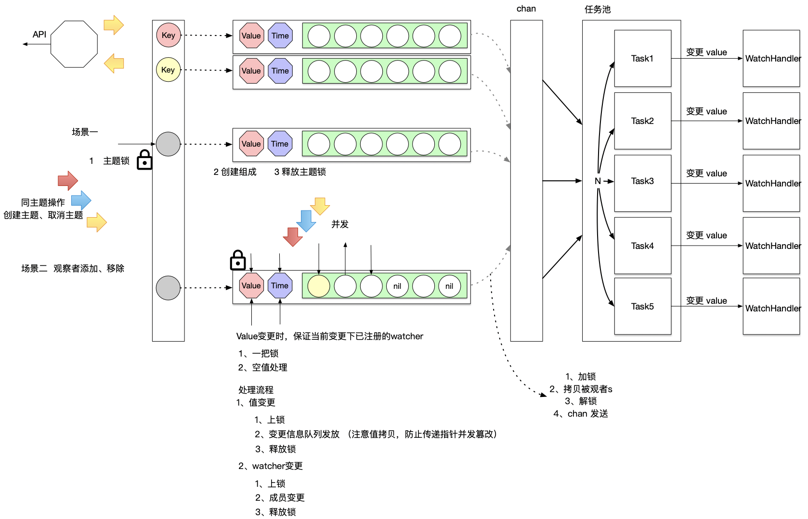

# 节点代理

## keywords

keywords en： System control、agent

keywords ch：节点控制、节点监控、服务器监控、系统控制  

## 描述

做一个节点控制的工具，可供远程操控机器，执行命令、传输文件

## 规定

### 文件命令规定

|        作用        | 缩写 | 备注 |
| :----------------: | :--: | :--: |
| 对象、pojo、struct |  ob  |      |
|        接口        |  in  |      |
|  业务、实现、处理  |  bz  |      |
|        工具        |  cm  |      |

## 总体设计

## 功能设计

### watch功能

其中任务池使用 https://github.com/wazsmwazsm/mortar/

### 使用 TODO

## 进展

